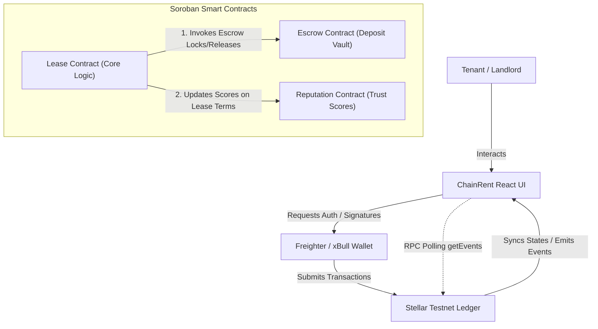

# ChainRent

## Secure Rental Agreements. Trustless Deposits.

**Live Demo:** [https://chainrent.netlify.app/](https://chainrent.netlify.app/)  
**Demo Video:** [https://drive.google.com/file/d/1Z9ZvsF9TzfIZqCQStb6zPhQF1XIKs3nN/view](https://drive.google.com/file/d/1Z9ZvsF9TzfIZqCQStb6zPhQF1XIKs3nN/view)  
**GitHub Repository:** [https://github.com/AvirajPrwith/ChainRent](https://github.com/AvirajPrwith/ChainRent)  

---

## Table of Contents
1. [Project Overview](#project-overview)
2. [Key Features](#key-features)
3. [Tech Stack](#tech-stack)
4. [System Architecture](#system-architecture)
5. [Folder Structure](#folder-structure)
6. [Local Setup & Installation](#local-setup--installation)
7. [Environment Variables Matrix](#environment-variables-matrix)
8. [Smart Contract Build & Deployment](#smart-contract-build--deployment)
9. [Wallet Integration & Transaction Flow](#wallet-integration--transaction-flow)
10. [Testing Suite](#testing-suite)
11. [CI/CD Pipeline](#cicd-pipeline)
12. [Screenshots & Narrative](#screenshots--narrative)
13. [Future Improvements](#future-improvements)
14. [Contribution Guide](#contribution-guide)
15. [License](#license)

---

## Project Overview

Traditional residential rental agreements suffer from high administrative overhead, lack of mutual trust, and frequent disputes regarding security deposits. ChainRent transforms the rental management ecosystem by shifting the trust layer from private intermediaries to the **Stellar Blockchain** using **Soroban Smart Contracts**. Security deposits are locked in escrow, rent is paid directly on-chain, and both tenants and landlords build verified reputation ratings based on successful lease completions and timely rent settlements.

---

## Key Features

- **Freighter & xBull Wallet Support:** Multi-wallet login integration with automated network passphrase validation.
- **Trustless Escrow Vault:** Escrow smart contract locks security deposits upon agreement signing, releasing them only upon lease termination or refund approval.
- **Real-Time RPC Event Streaming:** Direct frontend subscription to Soroban RPC contract events (`LeaseCreated`, `DepositLocked`, `LeaseApproved`, `LeaseTerminated`) utilizing polling listeners.
- **On-Chain Reputation Index:** Landlords and tenants build dynamic trust ratings (0-1000) managed entirely by a decentralized reputation smart contract.
- **Evidence Logs & Telemetry Console:** Interactive telemetry terminal displaying on-chain contract logs, method invocations, and Stellar Expert explorer links.
- **Vite Bundle Splitting:** Optimized production build config splitting `@stellar/stellar-sdk` and other dependencies into distinct modules.

---

## Tech Stack

- **Frontend:** React 19, TypeScript, Vite, TailwindCSS, Framer Motion, Lucide Icons
- **Stellar Node SDK:** `@stellar/stellar-sdk` (v16.0.1)
- **Stellar Wallets:** Freighter Wallet API, xBull Wallet Connect
- **Smart Contracts:** Rust, Soroban SDK (v22.0.1)
- **Testing Frameworks:** Vitest (Frontend), Cargo Test (Rust Smart Contracts)
- **CI/CD:** GitHub Actions (workflows verifying Rustfmt, Clippy, Node Linting, Typechecking, Vitest, and Production Builds)

---

## System Architecture



---

## Folder Structure

```
ChainRent/
├── .github/
│   └── workflows/
│       └── ci.yml             # GitHub Actions CI pipeline
├── contracts/
│   ├── Cargo.toml             # Workspace Cargo configuration
│   ├── lease/                 # Core Lease Smart Contract (Rust)
│   ├── escrow/                # Security Deposit Escrow Contract (Rust)
│   └── reputation/            # Tenant/Landlord Reputation Contract (Rust)
├── src/
│   ├── __tests__/             # Vitest unit tests
│   ├── components/            # Reusable UI components & ErrorBoundary
│   ├── context/               # React Contexts (Wallet, Toast, Leases)
│   ├── pages/                 # Layout views (Analytics, Escrow, Properties)
│   ├── services/              # Stellar Service, Soroban Event Streaming, db
│   ├── types/                 # TypeScript interfaces
│   ├── App.tsx                # React Router & Entry points
│   └── main.tsx               # App mounting point
├── package.json               # Frontend dependencies & scripts
├── vite.config.ts             # Rollup vendor bundle splitting config
└── tsconfig.json              # TypeScript compilation rules
```

---

## Local Setup & Installation

### Prerequisites
- [Node.js](https://nodejs.org/) v20+
- [Rust](https://www.rust-lang.org/) stable toolchain & Cargo
- [Freighter Wallet](https://www.freighter.app/) browser extension

### Installation Steps
1. **Clone the repository:**
   ```bash
   git clone https://github.com/AvirajPrwith/ChainRent.git
   cd ChainRent
   ```
2. **Install frontend dependencies:**
   ```bash
   npm install
   ```
3. **Configure environment variables:**
   Copy the example configuration to a local `.env` file:
   ```bash
   cp .env.example .env
   ```
4. **Launch local development server:**
   ```bash
   npm run dev
   ```

---

## Environment Variables Matrix

| Variable Name | Description | Default Testnet Value |
| --- | --- | --- |
| `VITE_STELLAR_NETWORK` | Target Stellar passphrase indicator | `testnet` |
| `VITE_HORIZON_URL` | Horizon REST API URL endpoint | `https://horizon-testnet.stellar.org` |
| `VITE_SOROBAN_RPC_URL` | Soroban RPC node URL endpoint | `https://soroban-testnet.stellar.org` |
| `VITE_LEASE_CONTRACT_ID` | Deployed Lease Smart Contract address | `CCDQLW2CKRUL4OCQDIW7SQ5VOT3IIMFTIZST3KVNAO3J5M6HJDLUTNF3` |
| `VITE_ESCROW_CONTRACT_ID` | Deployed Escrow Smart Contract address | `CDMLNC5EUTGZDAPOJSKGYGGOVPOSUFMRUXIWUB4C3ERJZIQSMXMDDI6N` |
| `VITE_REPUTATION_CONTRACT_ID` | Deployed Reputation Smart Contract address | `CDWJQYLPI6SBNGTUGAN4V3SA7GEE6LZIOMMU46CQPM4NHDTSGGU47HQO` |

---

## Smart Contract Build & Deployment

Contracts are compiled using the target wasm architecture:

1. **Build contracts:**
   Ensure `wasm32-unknown-unknown` target is installed:
   ```bash
   rustup target add wasm32-unknown-unknown
   ```
   Compile the contracts from the workspace root or the `contracts` subdirectory:
   ```bash
   cd contracts
   cargo build --target wasm32-unknown-unknown --release
   ```
2. **Optimize WASM binaries:**
   Optimize the generated wasm bytecode for size and gas execution:
   ```bash
   stellar contract optimize --wasm target/wasm32-unknown-unknown/release/chainrent_lease.wasm
   stellar contract optimize --wasm target/wasm32-unknown-unknown/release/chainrent_escrow.wasm
   stellar contract optimize --wasm target/wasm32-unknown-unknown/release/chainrent_reputation.wasm
   ```
3. **Deploy to Testnet:**
   ```bash
   stellar contract deploy \
     --wasm target/wasm32-unknown-unknown/release/chainrent_lease.optimized.wasm \
     --source <deployer-key> \
     --network testnet
   ```

---

## Wallet Integration & Transaction Flow

ChainRent utilizes Freighter Wallet and xBull Wallet API connectors to sign transactions. Users execute monthly rent payments or lock escrow funds by submitting native XLM transactions. Every action:
1. Builds the Transaction XDR via `StellarService.buildPaymentTx` or `buildAccountMergeTx`.
2. Passes XDR to the active wallet bridge (`signWithFreighter` / `signWithXBull`).
3. Transmits the signed envelope to the Horizon Testnet cluster, recording ledger hash receipts dynamically.

---

## Testing Suite

### Running Smart Contract Tests (Rust)
Unit tests simulate contract deployments, mock native stellar assets, mint token balances, and execute inter-contract calls. Run them via Cargo:
```bash
cd contracts
cargo test
```

### Running Frontend Tests (Vitest)
Unit tests target wallet context initialization, Horizon balance parsing, and local storage data persistence:
```bash
npm test
```

---

## CI/CD Pipeline

The automated CI/CD pipeline validates every commit and pull request on the repository through parallel job runs:
- **smart-contracts:** Setup Rust, verify code formatting (`cargo fmt --check`), analyze code quality (`cargo clippy`), and run unit tests.
- **frontend-app:** Setup Node.js, install dependencies (`npm ci`), run ESLint checks, verify TypeScript types (`tsc --noEmit`), run Vitest unit tests, and compile Vite production builds.

---

## Screenshots & Narrative

### Smart Contract Execution Proof
- **Transaction Hash:** `be4425c1c8cd263d23495054c3105de3484b23b9c2a593b7948a8937928c2aee`
- **Horizon Explorer Link:** [Stellar Expert Testnet Transaction](https://stellar.expert/explorer/testnet/tx/be4425c1c8cd263d23495054c3105de3484b23b9c2a593b7948a8937928c2aee)

### Execution Narrative
When a tenant creates or approves a lease:
1. The **Lease Contract** records the metadata and initializes status.
2. The core logic invokes `lock_deposit` on the **Escrow Contract**, transferring XLM tokens from the tenant's wallet to the contract vault.
3. Upon completion, the contract invokes the **Reputation Contract** to increment completed leases and trust metrics for both addresses.

---

## Future Improvements

- **Arbitration Multi-Sig:** Implement multi-party signatures for resolving security deposit disputes when landlords and tenants disagree on refunds.
- **Tokenized Properties:** Enable real estate tokenization allowing fractional property shares using SEP-41 compliant tokens.
- **WebSocket Event Hub:** Move from RPC HTTP event polling to active WebSocket subscription channels for sub-second event telemetry sync.

---

## Contribution Guide

1. Fork the repository.
2. Create a feature branch: `git checkout -b feature/amazing-feature`.
3. Commit your changes (ensure Clippy, ESLint, and all tests pass).
4. Push to the branch: `git push origin feature/amazing-feature`.
5. Open a Pull Request.

---

## License

Distributed under the MIT License. See `LICENSE` for more information.
